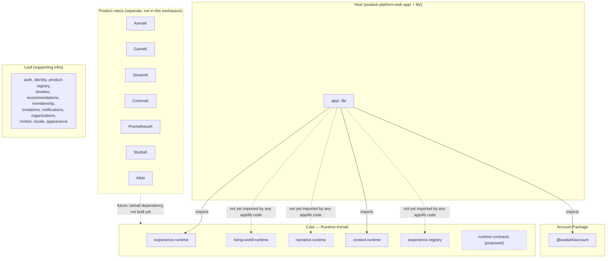

# Runtime Kernel Dependency Graph

Two classifications are presented, deliberately kept separate: **depth-tier** (the existing,
already-correct, dependency-depth ordering `scripts/build-packages.mjs` uses to build packages in
the right sequence) and **role-tier** (Leaf / Core / Host / Product, per this sprint's request —
a different axis, not a replacement for the depth-tier classification, which stays exactly as it
is).

---

## Role-tier classification

### Core (the Runtime Kernel itself)

```
experience-runtime · living-world-runtime · narrative-runtime · context-runtime ·
experience-registry · runtime-contracts (proposed, not yet created)
```

All six have (or, for the proposed one, would have) **zero `@avatark/*` dependencies** — verified,
not assumed, for the five existing ones. This is what makes them Core rather than incidental
leaves: they're distinguished by *role* (they constitute the execution layer the mission names the
Runtime Kernel), not by dependency depth — several other packages sit at the same zero-dependency
depth without being part of the Kernel (see Leaf, below).

### Leaf (supporting infrastructure, not part of the Kernel)

```
auth · identity · product-registry · timeline · recommendations · membership ·
invitations · notifications · organizations · motion · account · locale · appearance
```

Pre-existing, zero-`@avatark/*`-dependency packages the Runtime Kernel does not depend on today
(confirmed: no Core package imports any of these). `@avatark/account` sits here by dependency
depth, but is called out separately in the diagram below because of its *role* — it's the
destination the Host Adapter layer bridges to, not an incidental leaf like `motion` or `locale`.

One deliberate omission from this list: **`@avatark/timeline`** is a leaf by dependency depth but
flagged in [RUNTIME_GLOSSARY.md](./RUNTIME_GLOSSARY.md) as functionally superseded-in-practice by
`experience-registry` (Core). It's listed here because it hasn't been formally deprecated — not
because it's architecturally equivalent to the other leaves.

### Host (not a package — the running application)

`avatark-platform-web`'s own `app/` and `lib/` directories. This is the **only** place, in the
entire codebase today, where a Core (Runtime Kernel) package and `@avatark/account` are imported by
the same code:

- `lib/experienceRuntime/*`, `app/api/account/journey/*`, `app/account/page.tsx` → import
  `@avatark/experience-runtime` (Core)
- `lib/account/contextAdapter.ts`, `app/api/account/context/*` → import
  `@avatark/context-runtime` (Core) **and** `@avatark/account`'s `CurrentContextAdapter`/
  `CurrentContextState` types

No other Core package (`living-world-runtime`, `narrative-runtime`, `experience-registry`) has any
Host wiring yet — confirmed in Sprint 1's audit, unchanged since.

### Product (separate repositories — not packages in this repo at all)

```
ArenaK · GameK · StreamK · CinemaK · PrometheusK · StudioK · Atlas
```

None of these exist as packages or workspace members here. Per
[PLATFORM_INTEGRATION_SPRINT_1.md](./PLATFORM_INTEGRATION_SPRINT_1.md) §6, the established
cross-repo distribution mechanism is a versioned tarball/private-registry package (the same pattern
GameK already uses to vendor `@avatark/account`) — not a monorepo import. **`Atlas` is new to this
sprint's brief; nothing in this repo, any of the five branches, or Sprint 1's cross-repo audit
mentions it.** No integration specifics are invented for it here — see
[RUNTIME_KERNEL_ARCHITECTURE.md](./RUNTIME_KERNEL_ARCHITECTURE.md)'s Future Products section for
what's actually knowable (the generic contract every product gets, identical regardless of which
product) versus what isn't (Atlas-specific needs — unknown, not guessed at).

---

## The graph



Solid arrows are verified, real imports today. Dashed arrows/boxes are either proposed
(`runtime-contracts`), not yet wired (`living-world-runtime`/`narrative-runtime`/
`experience-registry`), or structurally future (Product repos — currently impossible, since none of
these packages is published anywhere yet).

## Cycle check

**Zero cycles exist, and none can be introduced by any of the five merges in
[MERGE_PLAYBOOK.md](./MERGE_PLAYBOOK.md), because the arrows only run one direction at every layer:**

- Core → nothing (all six, including the proposed `runtime-contracts`, have zero `@avatark/*`
  dependencies — verified for the five existing ones, designed that way for the sixth).
- Leaf → nothing (same property, pre-existing, unaffected by this sprint).
- Account Package → nothing back toward Core (confirmed: no reverse import from `@avatark/account`
  into any of the five Core packages).
- Host → Core, Host → Account Package (the only real edges crossing a role boundary). Host is never
  imported *by* anything — it's the application, not a package, so nothing can depend on it.
- Product (future) → Core, one direction, via a published tarball, never the reverse — Core has no
  knowledge any Product repo exists.

A cycle would require some package below Host to import something above it (e.g. a Core package
importing `@avatark/account`, or `@avatark/account` importing a Core package). Neither exists today,
and every recommendation in [RUNTIME_KERNEL_ARCHITECTURE.md](./RUNTIME_KERNEL_ARCHITECTURE.md)'s
adapter ownership matrix is specifically designed to keep it that way as more Host wiring lands.

## Depth-tier classification (existing, unchanged, for reference)

From `scripts/build-packages.mjs`, restated here only for cross-reference with the role-tier view
above — this is not a new classification, and this sprint does not change it (the two current gaps
— `experience-runtime` missing from `BUILD_ORDER`, and `living-world-runtime`/`narrative-runtime`/
`experience-registry` missing from `pack-packages.mjs` — are tracked as fixes to apply *at merge
time* in [MERGE_PLAYBOOK.md](./MERGE_PLAYBOOK.md), not changed by this document):

| Tier | Packages |
|---|---|
| Leaves (zero `@avatark/*` deps) | `auth, identity, product-registry, timeline, recommendations, membership, invitations, notifications, organizations, motion, account, locale, appearance` + the five new Core packages |
| One hop | `navigation` (→product-registry), `living-echo` (→timeline, recommendations), `journey` (→auth, invitations), `auth-ui` (→auth, product-registry) |
| Two hops | `account-ui` (→journey, membership, product-registry), `bootstrap` (→product-registry, navigation) |

Note that `@avatark/journey` (pre-existing, explicitly untouched this sprint per the mission's own
instruction) sits at the **one-hop** depth-tier, not the leaf tier — it depends on `auth` and
`invitations`. This is unrelated to, and does not conflict with, its separate identity as a
pre-existing concept `RUNTIME_GLOSSARY.md` distinguishes from the Core "Experience"/Journey
vocabulary.
