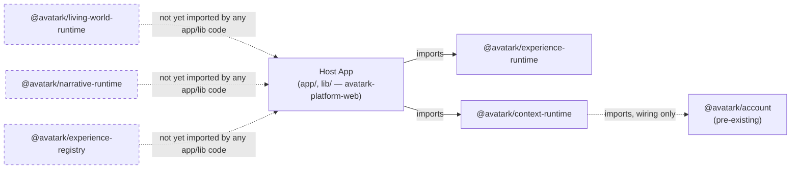
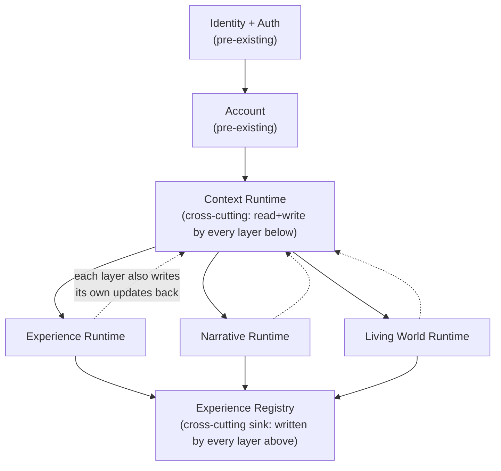
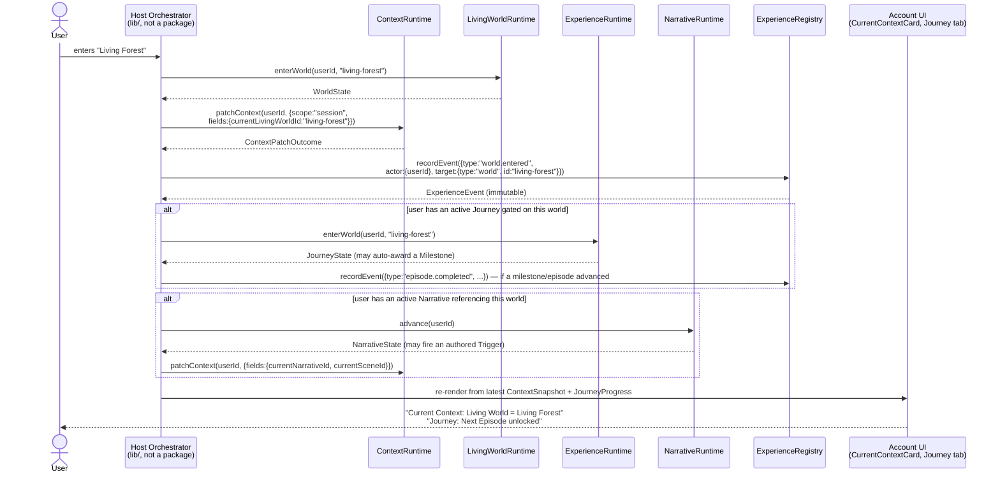

# Platform Integration Sprint 1 — Architecture Integration Report

**Status:** Analysis and design only. Nothing in this document has been implemented, merged, or
applied. Per mission constraints: no new runtime was built, no package was created, no branch was
merged, no migration was applied. This document is the deliverable.

**Branches reviewed** (all five share the identical merge-base `dc6bee2` on
`feature/avatar-platform-rc3` — true siblings, no drift between them):

| Branch | Commit | New package | App/lib footprint | Migration |
|---|---|---|---|---|
| `feature/experience-runtime` | `4c1baef` | `@avatark/experience-runtime` | Yes — `app/account/page.tsx`, `app/api/account/journey/`, `lib/experienceRuntime/` | `023_journey_states.sql` |
| `feature/living-world-runtime` | `b7a986d` | `@avatark/living-world-runtime` | None | none |
| `feature/narrative-runtime` | `eb6def1` | `@avatark/narrative-runtime` | None | none |
| `feature/context-runtime` | `1640997` | `@avatark/context-runtime` | Yes — `app/api/account/context/`, `lib/account/adapters.ts`, `lib/context/` | `023_context_snapshots.sql` |
| `feature/experience-registry` | `a9c0bb2` | `@avatark/experience-registry` | None | `023_experience_events.sql` |

All five package.json files declare **zero `@avatark/*` dependencies** — every new package is a
leaf. This one fact shapes almost every recommendation below: there is currently no
runtime-to-runtime coupling to untangle, only host-side (`app/`, `lib/`) wiring and five
independently-invented vocabularies that overlap in concept without overlapping in code.

---

## 1. Duplicate concept report

The instinct to worry about is "these five branches will collide when merged." They mostly won't
— at the *code* level, because none imports another. What they *do* share is the same handful of
English words for different (and sometimes genuinely different) things. That's the real
integration risk: not merge conflicts, but engineers and future agents assuming "Episode" or
"Journey" means one thing when it now means three or four.

### Episode

| Source | Shape | Meaning |
|---|---|---|
| `@avatark/experience-runtime` | `EpisodeDefinition { id, title, prerequisites, reflectionIds? }` | A progression *chunk* in a Journey — gated by prerequisites, has a completion event. |
| `@avatark/narrative-runtime` | `Episode { id, title, entrySceneId, scenes: Scene[] }` | A literary *container* — `Season > Episode > Scene > Beat`, authored story structure. |
| `@avatark/context-runtime` | `currentEpisodeId: string` (one of 13 context axes) | An opaque pointer, no type behind it — "whichever episode-shaped thing the product says is current." |
| `@avatark/experience-registry` | `episode.started` / `episode.completed` (event-type strings) | Not a type at all — just a naming convention for logging that *something* called an episode happened. |
| `@avatark/journey` (pre-existing) | *(none)* | Confirmed: `JourneyStepId` has no "episode" step. This package does not use the word. |

**Finding:** three real, structurally different `Episode` concepts (progression chunk, literary
container, opaque context id) plus a logging convention. None import each other, so there's no
compile error — but a future engineer wiring `context-runtime`'s `currentEpisodeId` to "the
episode" will have to pick which of the two typed Episodes (or neither) it means, every time.

### Scene

Only two sources: `narrative-runtime`'s `Scene { id, title, entryBeatId, beats }` (literary) and
`context-runtime`'s `currentSceneId` (opaque axis). Lower risk than Episode — no third meaning —
but the same "opaque id vs. typed definition" gap applies.

### World / Living World

| Source | Shape | Notes |
|---|---|---|
| `@avatark/living-world-runtime` | `WorldDefinition { id, name, entryLocationId, locations, activities }` + full `WorldRuntime` | The only **executable** World — enter/resume/leave/visit/unlock, real state machine. |
| `@avatark/experience-runtime` | `LivingWorldDefinition` (= alias of `JourneyNode`: `{id, title, prerequisites}`) | A lightweight *gate* in a Journey graph — no locations, no activities, just a prerequisite-checked node. |
| `@avatark/account` (pre-existing) | `LivingWorld { id, name, status, description, progress }` + `LivingWorldsAdapter.list()` | The **UI-facing contract** `CurrentContextCard`/`LivingWorldsTab` already render against. |
| `@avatark/narrative-runtime` | `WorldRef { worldId: string }` | Opaque pointer only — explicitly "World domain not implemented here." |
| `@avatark/context-runtime` | `currentLivingWorldId: string` | Opaque axis. |

**Finding:** this is the most-duplicated concept by volume (5 representations) but arguably the
*healthiest* one, because the shapes cleanly separate by role: one real engine
(`living-world-runtime`), one UI contract it should eventually feed (`@avatark/account`'s
`LivingWorld`), and three opaque references pointing at "whichever of those two" from elsewhere.
`living-world-runtime` already ships `createLivingWorldsAccountAdapter()` that structurally
matches `@avatark/account`'s `LivingWorldsAdapter` — the missing piece is wiring, not design.

### Practice / Reflection

Both concepts show the *same* pattern, so grouping them:

| Source | Practice shape | Reflection shape |
|---|---|---|
| `experience-runtime` | `PracticeDefinition { id, title, kind: "practice"\|"challenge", prerequisites, required? }` (real definition) | `ReflectionDefinition { id, episodeId, prompt }` (real definition) |
| `living-world-runtime` | `WorldPracticeRef { practiceId, source }` | `WorldReflectionRef { reflectionId, source }` |
| `narrative-runtime` | `PracticeRef { practiceId }` | `ReflectionRef { reflectionId }` |
| `context-runtime` | `currentPracticeId` | `currentReflectionId` |

**Finding — the sharpest, most actionable duplication in the whole review:**
`living-world-runtime`'s `WorldPracticeRef`/`WorldReflectionRef` and `narrative-runtime`'s
`PracticeRef`/`ReflectionRef` are **independently hand-rolled, near-identical opaque ref shapes**
(`{practiceId: string}` twice, `{reflectionId: string}` twice, one with an extra `source` field).
No canonical "Practice" or "Reflection" *engine* exists anywhere in these five branches — every
package treats them as an external system it points at but doesn't implement. This is exactly the
kind of present-tense, observed duplication `packages/runtime-contracts` (§3) should absorb.

### Journey

The single most confusing word in the combined system. Three unrelated meanings now exist:

1. `@avatark/journey` (pre-existing, untouched) — a fixed 9-step **invitation → arena onboarding
   funnel** state machine (`JourneyStepId`). Nothing to do with content or progression.
2. `@avatark/experience-runtime`'s `JourneyDefinition`/`JourneyRuntime` — a **progression engine**
   over Episodes/Worlds/Practices/Milestones. This is what most people would guess "Journey" means
   in this codebase today, but it's the *newest* of the three.
3. `@avatark/account`'s pre-existing `CurrentContextState.journey: string | null` field — a bare
   label the UI has rendered since before any of these five branches existed. `context-runtime`'s
   `lib/account/contextAdapter.ts` maps this from **`currentNarrativeId`**, not from anything
   `experience-runtime` produces — so the field labeled "journey" in the account UI is about to
   start displaying narrative-runtime data, while a *different*, unrelated "Journey" tab
   (`experience-runtime`'s) renders on the same account page.

**This is not a code conflict** (no shared types, no imports) but it is a near-certain source of
user- and engineer-facing confusion the moment both `experience-runtime` and `context-runtime` are
merged: the account page will have a "Journey" tab (experience-runtime's progression UI) sitting
next to a "Current Context" card whose "Journey" field shows narrative-runtime data. Recommend an
explicit renaming decision at merge time — not resolved here, since renaming
`CurrentContextState.journey` or relabeling the UI field is a `@avatark/account` contract change
outside this sprint's scope, but it should not be merged silently.

### Milestone / Challenge

Good news: **no collision.** `MilestoneDefinition`/`MilestoneCriteria` exist only in
`experience-runtime`. "Challenge" is a `kind` variant of `PracticeDefinition` there, plus a pair of
event-type strings (`challenge.started`/`challenge.completed`) in `experience-registry`. Nothing to
reconcile.

### Context

Three surfaces, cleanly layered rather than colliding:

- `@avatark/context-runtime` — the canonical, 13-axis model (`ContextSnapshot`/`ContextFields`).
- `@avatark/account` (pre-existing) — the narrow, 4-field UI contract (`CurrentContextState`:
  `livingWorld`/`journey`/`episode`/`practice`) that predates `context-runtime` and that
  `context-runtime`'s own `lib/account/contextAdapter.ts` maps *down into*.
- `@avatark/narrative-runtime`'s `NarrativeContextRef { key: string }` — a bare, **untyped** string
  pointing at "ambient platform Context." Nothing enforces that `key` is actually one of
  `context-runtime`'s 13 real `ContextFieldKey` values — it could be any string today. This is a
  concrete gap `runtime-contracts` should close (§3).

### History / Progress / State / Event — one root cause, four symptoms

These four words are really one finding wearing four names, so they're grouped:

| Package | "State" | "Progress" | "History" | "Event"-shaped entry |
|---|---|---|---|---|
| `experience-runtime` | `JourneyState` | `JourneyProgress { percentComplete, next* }` | `JourneyHistory { transitions }` | `JourneyTransition { type, at, nodeId?, detail? }` |
| `living-world-runtime` | `WorldState` | `WorldProgress { percentComplete, visited/unlocked counts }` | `WorldHistory { visits, transitions }` | `WorldTransition { from, to, at, allowed, reason? }` |
| `narrative-runtime` | `NarrativeState` | `NarrativeProgress` (position + completed-id lists, **no** `percentComplete`) | `NarrativeHistory { entries }` | `NarrativeHistoryEntry { kind, at, ...optional ids }` |
| `context-runtime` | `ContextSnapshot` (deliberately *not* called "State") | *(none — context has no notion of completion)* | `ContextHistoryEntry` (whole-snapshot + patch, not a discrete event) | *(none — see previous)* |
| `experience-registry` | *(none — stateless by design)* | *(none)* | `listTimeline()` | `ExperienceEvent { id, schemaVersion, type, source, actor, target?, metadata, occurredAt, recordedAt, correlationId?, sessionId? }` — the only **rich**, typed, validated event shape of the five |

**Finding:** four packages independently built their own append-only "things that happened" log
(`JourneyTransition`, `WorldTransition`, `NarrativeHistoryEntry`, `ContextHistoryEntry`), each with
a different minimal shape, none built on top of `experience-registry`'s considerably more complete
`ExperienceEvent` (typed source/actor/target/metadata, validated, schema-versioned, immutable by
construction). This is the single biggest *structural* opportunity in this review: three
progression engines are each maintaining a bespoke transition log that `experience-registry`
already generalizes correctly. Not a Sprint 1 rewrite (see §11), but worth stating plainly:
**`experience-registry` is not "one more event package" — it is the thing the other four should
eventually delegate their History to,** emitting into it rather than maintaining parallel logs.

### Timeline vs. Experience Registry — a pre-existing package this sprint should reconcile with

`@avatark/timeline` **already existed** before any of these five branches, as a contract-only
package: `TimelineEntry`/`TimelineEventType` (10 fixed kinds)/`TimelineAdapter`, explicitly
documented as having "no real implementation anywhere." `@avatark/experience-registry` is, in
substance, **the real implementation of exactly what `timeline` promised** — an append-only,
per-user, product-tagged event log — except open-ended (`namespace.verb_phrase` strings, not a
closed 10-value enum) and actually built (repository, validation, in-memory impl, 4 query methods).

**Finding:** these two packages should not both graduate into production use as separate things.
Recommend (Sprint 2, not this sprint): either (a) deprecate `@avatark/timeline` in favor of
`@avatark/experience-registry`, with a thin `TimelineEventType → ExperienceType` mapping note for
anything already written against the old contract, or (b) make `timeline`'s `TimelineAdapter` a
documented *consumer* of the registry rather than an independent contract. Flagging, not deciding —
this is exactly the kind of judgment call that belongs to whoever owns the account activity-stream
UI, not to this integration pass.

### Repository

Five interfaces, five different method-name conventions for equivalent operations:

| Package | Interface | "read state" | "write state" | "history" |
|---|---|---|---|---|
| experience-runtime | `JourneyRepository` | `getState` | `saveState` | `appendTransition` / `getHistory` |
| living-world-runtime | `WorldStateRepository` | `get` | `save` | `appendTransition` / `getTransitions` |
| narrative-runtime | `NarrativeRepository` | `getState` | `saveState` | *(none — history is embedded in the saved `NarrativeState` blob)* |
| context-runtime | `ContextRepository` | `loadSnapshot` | `saveSnapshot` | `appendHistory` / `loadHistory` / `loadHistoryEntry` |
| experience-registry | `ExperienceEventRepository` | `findById` / `findByUser` | `insert` | *(the whole repository IS history — no separate concept)* |

**Recommendation:** do **not** force these into one shared `Repository<T>` interface — the
domains genuinely differ (narrative-runtime's history-in-state-blob vs. the others' separate
history stream is a real design choice, not an accident, per its own repository comment). Forcing
a common interface here would be exactly the "speculative redesign" this mission rules out. The
only worthwhile Sprint 2 action is a **naming convention note** (not a type): prefer `get`/`save`
for single-state, `append`/`list` for history streams — so a sixth repository doesn't invent a
sixth vocabulary.

### Adapter — three unrelated architectural roles hiding under one word

This is the finding that most directly feeds §8 (adapter ownership matrix), so it's stated here in
full:

1. **Runtime-internal side-effect hook** — the runtime calls *out* on every transition, fire-and-forget.
   Example: `JourneyAdapter.onTransition(event)`. Direction: runtime → product.
2. **Runtime default-value source** — the runtime calls *out* to ask "what should this field default
   to for this product." Example: `ContextAdapter.getDefaults(userId)`. Direction: product → runtime
   (data flows back in), inverse of (1) even though both are called "Adapter."
3. **Account-surface UI adapter** — reshapes a runtime's output to match `@avatark/account`'s
   pre-existing UI contracts. Examples: `living-world-runtime`'s
   `createLivingWorldsAccountAdapter()` (matches `LivingWorldsAdapter`),
   `experience-registry`'s `createExperienceActivityAdapter()` (matches `ExtensionAdapter`),
   `context-runtime`'s `lib/account/contextAdapter.ts` (matches `CurrentContextAdapter`). Direction:
   host → runtime → reshaped → `@avatark/account`. This role has **nothing to do with the runtime's
   own operation** — it exists purely so a host doesn't have to write glue code by hand.

Roles (1) and (2) are legitimately part of a runtime's own public contract (they're how a
product customizes runtime behavior) and belong in the runtime package as **interfaces only**.
Role (3) is host-integration glue with zero bearing on the runtime's internal correctness — see §8
for where it should actually live (spoiler: two of the three examples above put it in the wrong
place).

### Runtime

Four true orchestrators plus one deliberate non-orchestrator:

- `JourneyRuntime` (class) — experience-runtime
- `WorldRuntime` (interface, built via `createWorldRuntime()` factory) — living-world-runtime
- `NarrativeRuntime` (interface, built via `createNarrativeRuntime()` factory) — narrative-runtime
- `ContextRuntime` (class) — context-runtime
- `ExperienceRegistry` (class, deliberately **not** named "Runtime" — its own description explicitly
  says "not a state machine... not a progression runtime") — experience-registry

**Finding (cosmetic, low priority):** two are constructed as classes (`new JourneyRuntime(...)`,
`new ContextRuntime(...)`), two are constructed via factory functions returning an interface
(`createWorldRuntime(...)`, `createNarrativeRuntime(...)`). Not a bug — both are valid TypeScript
patterns — but worth converging on one style in Sprint 2 for consistency, not urgency.

---

## 2. Shared contracts proposal — `packages/runtime-contracts` (design only)

### Why this clears the "don't invent packages" bar

The mission says not to invent new packages unless absolutely required. This one clears that bar
because the duplication it would absorb is **already observed, not hypothetical**: three packages
today independently define byte-for-byte-identical `{practiceId: string}` /
`{reflectionId: string}` opaque-ref shapes, and one (`narrative-runtime`'s
`NarrativeContextRef.key`) has an unenforced string where a fourth package
(`context-runtime`) already has the real typed union it should have been checked against.

### Contents (and *only* these — no logic, no repository, no adapter, no runtime)

```ts
// packages/runtime-contracts/src/ids.ts
export type UserId = string
export type ProductId = string   // matches @avatark/product-registry's AvatarKProduct.id
export type Timestamp = string   // ISO-8601 — currently redefined ad-hoc in 3+ places

// packages/runtime-contracts/src/refs.ts
// Collapses experience-runtime/living-world-runtime/narrative-runtime's three
// independent near-identical shapes into one each.
export interface PracticeRef { practiceId: string; source?: string }
export interface ReflectionRef { reflectionId: string; source?: string }
export interface WorldRef { worldId: string }
export interface EpisodeRef { episodeId: string }
export interface NarrativeRef { narrativeId: string }

// packages/runtime-contracts/src/context.ts
// Re-exported, not redefined — context-runtime keeps ownership (see open
// question below). Lets NarrativeContextRef.key (and any future package's
// "context key" field) be typed against the real union instead of `string`.
export type { ContextFieldKey } from '@avatark/context-runtime'
```

That's the entire package. No `Repository<T>`, no `Adapter<T>`, no `Runtime` base class — per §1's
Repository/Adapter findings, those domains are different enough that a forced shared interface
would be pure abstraction with no behavior behind it, which is exactly the "speculative redesign"
the mission rules out.

### Open question, flagged not resolved

Should `ContextFieldKey` be *defined* in `runtime-contracts` (with `context-runtime` importing it
back — inverting today's ownership) or stay defined in `context-runtime` (with `runtime-contracts`
only re-exporting it, as sketched above)? Recommend the latter for Sprint 2: keep `context-runtime`
as the owner, avoid a "who owns the canonical list" fight before any package actually needs the
answer. Revisit once `narrative-runtime`'s `NarrativeContextRef` is *actually* retyped against it
in practice, not before.

### What consuming packages change (Sprint 2, not this sprint)

- `living-world-runtime`: `WorldPracticeRef`/`WorldReflectionRef` → import `PracticeRef`/`ReflectionRef`.
- `narrative-runtime`: `PracticeRef`/`ReflectionRef`/`WorldRef` → import from `runtime-contracts`;
  `NarrativeContextRef.key: string` → `NarrativeContextRef.key: ContextFieldKey`.
- `experience-runtime`: no change forced — its `EpisodeDefinition`/`LivingWorldDefinition` are full
  definitions, not opaque refs, and stay exactly as they are.

None of this is a breaking change to any of the five branches' own tests, since none of them import
`runtime-contracts` today — this is purely additive until Sprint 2 opts individual packages in.

---

## 3. Runtime dependency graph

### 3.1 The graph that actually exists today (verified, not assumed)



Solid arrows are real, verified imports. Dashed arrows/boxes mark packages with **zero** app/lib
consumers today — `living-world-runtime`, `narrative-runtime`, and `experience-registry` are fully
built, tested, and completely unwired. This is not a defect (all three explicitly deferred wiring
per their own mission scope) but it does mean three of the five deliverables are, right now,
100%-tested dead code from the running app's point of view.

Critically: **there are zero runtime-to-runtime imports anywhere.** No package imports another
package from this batch of five. The only cross-boundary import at all is `context-runtime`'s host
glue (`lib/account/contextAdapter.ts`) reaching into `@avatark/account` — and that's the host doing
it, not `context-runtime` itself (its own `package.json` still lists zero dependencies).

### 3.2 Why the mission's example chain is the wrong shape — and what to build instead

The mission's suggested graph (`Identity → Account → Context → Experience → Narrative → LivingWorld
→ Registry`) reads naturally but conflates two different things: a *compile-time import graph* and
a *runtime orchestration order*. Building the former — making `narrative-runtime` literally
`import` from `experience-runtime`, which `import`s from `context-runtime`, etc. — would violate
the mission's own rules ("minimize coupling," "prefer interfaces over imports," "preserve leaf
packages") and would make every downstream package fail to build the moment any upstream one has a
breaking change. **All five branches independently, correctly avoided this.** Don't undo that.

What the example is actually gesturing at is *sequencing*: which questions must be answered before
which others, for one user, during one interaction. That's not a dependency graph — it's an
orchestration order, and it belongs to the **host**, not to any package. Recommended model:



Two corrections to the mission's own example, both load-bearing:

1. **Context is not a one-way upstream stage — it's a bus.** Every layer both *reads* it (to know
   which Journey/Narrative/World applies to this user right now) and *writes* it (a completed
   episode should update `currentEpisodeId`, not just live inside `experience-runtime`'s own
   `JourneyState`). Modeling it as strictly "between Account and Experience" undersells it.
2. **Registry is not the last link in a chain fed only by Living World — it's a sink fed by every
   layer.** `Experience Runtime`, `Narrative Runtime`, and `Living World Runtime` should each emit
   events into it independently; none of them needs to go "through" another to reach it.
3. **Experience Runtime, Narrative Runtime, and Living World Runtime are siblings, not a chain.**
   Nothing in any of the three requires another to function (confirmed: zero `@avatark/*` deps in
   all three `package.json`s). A host may run all three for one product, or just one, depending on
   what that product needs — GameK might use only `living-world-runtime`; a StudioK-authored
   narrative experience might use only `narrative-runtime`. Chaining them by default would create
   an artificial requirement none of the actual code has.

The correct place to encode "for *this* interaction, call Context, then Experience, then Registry"
is a **host-level orchestrator** (e.g. a new `lib/experienceOrchestrator.ts`, not a package) — see
§9 for exactly what that looks like for one full interaction.

---

## 4. Merge plan

### 4.1 Blast-radius ranking (measured, not estimated)

| Branch | Shared files touched outside its own package dir | Migrations | Real app/lib wiring |
|---|---|---|---|
| narrative-runtime | `package.json`, `pnpm-lock.yaml`, `scripts/build-packages.mjs` | 0 | none |
| living-world-runtime | `package.json`, `pnpm-lock.yaml`, `scripts/build-packages.mjs` | 0 | none |
| experience-registry | `package.json`, `pnpm-lock.yaml`, `scripts/build-packages.mjs` | 1 (`023`) | none |
| context-runtime | + `scripts/pack-packages.mjs`, `supabase/scripts/run-platform-migrations.js`, `lib/account/adapters.ts`, 2 new API routes | 1 (`023`, registered in the apply script) | **modifies shared `lib/account/adapters.ts`** |
| experience-runtime | + `app/account/page.tsx`, 1 new API route | 1 (`023`, not registered in the apply script) | **modifies shared `app/account/page.tsx`** |

### 4.2 Recommended order

1. **`narrative-runtime`** — zero migrations, zero app touches, the purest possible addition.
   Merging first means the three perennially-conflicting shared files (`package.json`,
   `pnpm-lock.yaml`, `scripts/build-packages.mjs`) get their first new entry with nothing to
   conflict against yet.
2. **`living-world-runtime`** — identical risk profile to (1). Second, so its
   `scripts/build-packages.mjs` line resolves against the one line already merged, not zero —
   trivial.
3. **`experience-registry`** — introduces the first real migration (`023_experience_events.sql`)
   and the Timeline-vs-Registry question (§1). Deliberately placed third, *after* the two
   zero-migration branches, so the first migration-numbering decision isn't rushed as literally the
   first PR of the sprint. This merge also keeps `023` as its number (see §5) — it becomes "the"
   023.
4. **`context-runtime`** — first branch that touches shared, already-live code
   (`lib/account/adapters.ts`) and ships real, user-facing API routes. Needs functional
   verification (does `/api/account/context` actually work end-to-end, does `CurrentContextCard`
   render real data) that the first three don't. Doing it fourth means reviewers aren't
   context-switching between "trivial leaf addition" review and "shared-code-path" review in the
   same sitting. Migration renumbers `023` → `024` at merge time (see §5).
5. **`experience-runtime`** — merges last because it touches the *other* shared, live file
   (`app/account/page.tsx`) and should land reconciled against `context-runtime`'s already-merged
   `adapters.ts` change — both touch the account surface, and reviewing them back-to-back is the
   best moment to catch the "three Journeys" naming confusion (§1) while it's fresh, before either
   one becomes load-bearing. Migration renumbers `023` → `025` at merge time (see §5). **Also fix at
   this merge:** register `experience-runtime` in `scripts/build-packages.mjs`'s `BUILD_ORDER` — it
   is currently the only one of the five *not* added there, so `pnpm build:packages` silently skips
   it today.

### 4.3 What must wait, and why

Nothing needs to wait indefinitely, but two things should happen **before** step 4 or 5 above, not
after:

- An explicit written decision (even a one-paragraph ADR note) on the "Journey" naming collision
  (§1) — not necessarily a rename, but a conscious acknowledgment on record, since both
  `context-runtime` and `experience-runtime` are about to make the ambiguity user-visible on the
  same account page.
- Confirmation of who reviews `context-runtime`'s `lib/account/adapters.ts` diff specifically
  against whatever else may have landed on `@avatark/account` in the meantime (that package has had
  frequent recent changes per repo history) — this is the one merge in the whole plan touching
  code another workstream also owns.

No branch in this batch has a *hard* dependency forcing it to wait on another — restated from §3,
all five are leaves. The ordering above is a risk/review-sequencing recommendation, not a
correctness requirement.

---

## 5. Migration reconciliation plan

### 5.1 The collision, precisely

Three branches, not two, independently used migration number `023` off the same `dc6bee2` base:

| File | Branch | Tables |
|---|---|---|
| `023_journey_states.sql` | experience-runtime | `journey_states`, `journey_transitions` |
| `023_experience_events.sql` | experience-registry | `experience_events` |
| `023_context_snapshots.sql` | context-runtime | `context_snapshots`, `context_history` |

No foreign keys exist between any of these three schemas — each references only `auth.users(id)`.
**There is no dependency-ordering requirement between them; renumbering is purely a filename/hygiene
exercise, not a correctness one.**

### 5.2 Renumbering plan (matches merge order in §4)

| New number | File | Rename at merge time | Register in `supabase/scripts/run-platform-migrations.js`? |
|---|---|---|---|
| `023` | `023_experience_events.sql` | No change (merges 3rd, keeps its number) | Not currently registered by that branch — **add it**, since it's the migration actually landing first. |
| `024` | `023_context_snapshots.sql` → `024_context_snapshots.sql` | Update filename + internal header comment | Already registered by this branch (append after 023, update the number in the registration too). |
| `025` | `023_journey_states.sql` → `025_journey_states.sql` | Update filename + internal header comment | Not currently registered by that branch — **add it**, immediately after 024. |

### 5.3 Existing backlog this sprint inherits (not caused by it)

Per prior-session records, migrations `020` (capability grants) and `022` (profile location
normalized) are *also* already unapplied on `feature/avatar-platform-rc3`. By the time this
sprint's three renumbered migrations land, the unapplied backlog will be five migrations deep
(`020`, `022`, `023`, `024`, `025`). **Recommend a dedicated "apply the backlog" pass as an explicit
prerequisite to Sprint 2**, run by whoever has real database access — outside this sprint's scope
per its own rules ("do NOT apply migrations"), but worth surfacing loudly rather than letting the
backlog grow silently past five.

### 5.4 Safe application order

Once renumbered: `020 → 022 → 023 (experience_events) → 024 (context_snapshots) → 025
(journey_states)`. All three new ones are mutually independent (no FKs between them), so their
relative order among themselves doesn't matter for correctness — the order above is just "match
the merge order" for traceability, nothing more.

---

## 6. Host integration plan — AvatarK, ArenaK, GameK, StudioK, StreamK, PrometheusK

### 6.1 The current reality

Per this repo's own prior cross-repo audit (`docs/CONSUMER_PLATFORM_ARCHITECTURE.md`), ArenaK,
GameK, StreamK, CinemaK, and PrometheusK are **separate repositories**, not workspace members of
`avatark-platform-web`. None of them import any of these five new packages today, and — this is the
important structural fact — **none of them can, until `avatark-platform-web` publishes them**, per
the same doc's established distribution mechanism: versioned tarball / private-registry package,
pinned per that doc's dual-versioning discipline (the same pattern GameK already uses to vendor
`@avatark/account`). `avatark-platform-web` has zero dependency on any satellite repo's code.

**This makes circular dependencies structurally impossible today** — the arrow only ever points one
way (satellite repo → published `@avatark/*` package), and none of these five packages currently
even resolves that far (none is published; all are workspace-local to this repo).

### 6.2 How each host actually plugs in — and why StudioK is different from the other five

| Host | What it would consume | Dependency shape |
|---|---|---|
| AvatarK (this repo) | Already the host for `experience-runtime` and `context-runtime`; `living-world-runtime`/`narrative-runtime`/`experience-registry` awaiting wiring | Code dependency (imports the package) |
| ArenaK, GameK, StreamK, CinemaK, PrometheusK | Whichever runtimes their product needs (e.g. GameK might use only `living-world-runtime`; PrometheusK's existing practice-runtime handoff is unrelated to any of these five) | Code dependency, via published tarball — **not built yet for any of them** |
| **StudioK** | `narrative-runtime`'s `NarrativeDefinition` shape | **Data dependency, not a code dependency.** `narrative-runtime`'s own package description says it plainly: "StudioK authors the definitions this package executes." StudioK's integration point is authoring JSON that conforms to `NarrativeDefinition`, then handing it to whichever host actually runs `createNarrativeRuntime()` — StudioK itself never needs to import or execute the runtime. |

This distinction matters for Sprint 2 planning: five of the six named hosts need a *code*
integration (import the package, call its runtime); StudioK needs a *content-authoring* tool
against a *schema* (validated today by `validateNarrativeDefinition`), which is a materially
different, and much smaller, integration surface.

### 6.3 Avoiding circularity going forward

The one rule that keeps this safe as real cross-repo integration begins: **no runtime package may
ever import from an app-level or host-level module** (only the reverse). All five packages already
satisfy this (zero `@avatark/*` deps, no imports of `lib/` or `app/` anything). The only place this
discipline could slip is inside a *host's* glue code accidentally being pulled back into a package
(e.g., if `living-world-runtime`'s `src/adapters/livingWorldsAccount.ts` — which structurally
mirrors `@avatark/account` — ever gained a real `import` of `@avatark/account` instead of staying
structural). See §7 for why that file should move out of the package entirely, which sidesteps the
question altogether.

---

## 7. Adapter ownership matrix

| Role | Direction | Belongs in | Current examples | Verdict |
|---|---|---|---|---|
| Runtime-internal side-effect hook | runtime → product (fire-and-forget) | **Runtime package**, interface only; concrete implementations live in the host/product | `JourneyAdapter.onTransition` | ✅ Correctly placed |
| Runtime default-value source | product → runtime (data flows back in) | **Runtime package**, interface only; implementations in the host | `ContextAdapter.getDefaults` | ✅ Correctly placed |
| Persistence adapter (real store) | runtime ↔ database | **Host app's `lib/`**, never inside the runtime package (which ships only the interface + an in-memory reference impl) | `lib/experienceRuntime/supabaseJourneyRepository.ts`, `lib/context/supabaseContextRepository.ts` | ✅ Correctly placed (both existing examples) |
| Account-surface UI adapter (reshape runtime output → `@avatark/account` contract) | host → runtime → reshape → `@avatark/account` | **Host app's `lib/`** — never inside the runtime package, never inside `@avatark/account` itself | `lib/account/contextAdapter.ts` (✅ correct) vs. `living-world-runtime`'s `src/adapters/livingWorldsAccount.ts` and `experience-registry`'s `src/activityAdapter.ts` (❌ both live inside the runtime package) | **Inconsistent across the five branches — see below** |
| Identity/session resolution | n/a — should never exist as a per-runtime concept | `packages/identity` + `packages/auth` (pre-existing), consumed by the host only | All five runtimes correctly take a plain `userId: string` parameter instead of depending on identity/auth | ✅ All five got this right |

### The one concrete fix this matrix identifies

`living-world-runtime`'s `src/adapters/livingWorldsAccount.ts` and `experience-registry`'s
`src/activityAdapter.ts` both currently ship *inside* the runtime package, structurally mirroring
`@avatark/account`'s contracts without importing them. `context-runtime` and `experience-runtime`
solved the identical problem by putting the equivalent glue in the **host's** `lib/`
(`lib/account/contextAdapter.ts`, `lib/experienceRuntime/journeyDefinition.ts`) instead. The
inconsistency isn't a compile-time coupling problem (none of the three files actually imports
`@avatark/account`) — it's a maintenance-ownership problem: every consumer of
`@avatark/living-world-runtime` or `@avatark/experience-registry` (including, eventually, a
satellite repo with no `@avatark/account` at all) carries a file whose only purpose is matching a
contract it may not even use. **Recommend moving both files to the host at merge time** (e.g.
`lib/livingWorldRuntime/accountAdapter.ts`, `lib/experienceRegistry/accountAdapter.ts`), matching
the pattern the other two branches already established correctly.

---

## 8. Event flow — sequence diagram

Worked example matching the mission's own prompt: a user enters a Living World, and that ripples
through Context, an active Narrative, an active Journey, the Registry, and back to the Account UI.
Every call originates from the **host orchestrator** — no runtime ever calls another runtime
directly, per §3.2.



Notes on why the diagram is shaped this way:

- **Context is touched twice** (before and after the Narrative/Journey calls) — it's the
  cross-cutting bus from §3.2, not a one-time upstream lookup.
- **Registry is called independently by the Host**, not chained after Living World specifically —
  matching the "sink fed by every layer" correction in §3.2. In a fuller implementation, the Journey
  and Narrative branches would each also call `recordEvent` for their own transitions, not only the
  world-entry one shown here for brevity.
- **No arrow ever goes runtime → runtime.** Every arrow either starts or ends at the Host — this is
  the concrete enforcement of §3.2's "no runtime-to-runtime imports" rule at the *call* level, not
  just the *import* level.

---

## 9. Integration risks

Ranked by combination of likelihood and blast radius, not just severity:

1. **Naming collisions surfacing to end users before anyone decides what to do about them
   (High likelihood, Medium blast radius).** The "three Journeys" and "four Episodes" (§1) become
   simultaneously visible on the account page the moment `experience-runtime` and `context-runtime`
   both merge. Neither branch is *wrong* in isolation; the confusion is emergent. Mitigate per §4.3
   (explicit written decision before those two merges).

2. **Migration renumbering forgotten or done inconsistently (Medium likelihood, High blast radius
   if missed).** Three branches claim `023`; only a disciplined merge process (§5) catches this.
   If `context-runtime` and `experience-runtime` are merged by different people without reading
   this document, both will try to keep `023` and the second one to merge will get a real
   `git apply`/migration-runner conflict — or worse, silently overwrite the first if migrations are
   ever applied by filename rather than by content review.

3. **Shared-file merge conflicts treated as "just resolve the diff" instead of "regenerate"
   (Medium likelihood, Medium blast radius).** All five branches touch `pnpm-lock.yaml`. Hand-merging
   lockfile conflicts (rather than deleting and running `pnpm install` after each merge) risks
   silently reintroducing a stale dependency resolution. Recommend: after each merge in §4.2's order,
   regenerate the lockfile rather than resolve its conflict textually.

4. **Inconsistent self-registration across the five branches (Low likelihood of breakage, but a real
   gap today).** `experience-runtime` is missing from `scripts/build-packages.mjs`; `living-world-runtime`,
   `narrative-runtime`, and `experience-registry` are all missing from `scripts/pack-packages.mjs`
   (only `context-runtime` registered itself there). None of this breaks tests (which run against
   source, not `dist/`), but it means `pnpm build:packages`/`pnpm pack:packages` will silently produce
   an incomplete artifact set today. Fix at each branch's own merge time (already folded into §4.2's
   plan for `experience-runtime`; apply the same check for the other three).

5. **Three progression engines maintaining parallel bespoke History logs instead of the one real
   Registry (Low likelihood of near-term breakage, High long-term cost).** Not urgent — none of the
   three (`JourneyTransition`, `WorldTransition`, `NarrativeHistoryEntry`) is broken — but every
   sprint that passes without addressing §1's "History/Event" finding makes eventually consolidating
   onto `experience-registry` a larger migration, not a smaller one. Recommend flagging as a Sprint 3+
   candidate now, before a sixth runtime invents a sixth History shape.

6. **`@avatark/timeline` and `@avatark/experience-registry` both graduating into real use as separate
   things (Low likelihood this sprint, since neither is wired to app code yet — but the window to
   cheaply reconcile them closes the moment either one gets a real consumer).** See §1's dedicated
   finding. Recommend a decision *before* Sprint 2 wires either one into the account activity feed.

7. **`context-runtime`'s merge touching `@avatark/account` code that other, unrelated workstreams
   also actively modify (Medium likelihood, Medium blast radius).** This repo's git history shows
   frequent, recent, unrelated changes to account-surface code. `lib/account/adapters.ts` is the one
   file in this entire five-branch batch that isn't purely additive to a workstream's own package —
   it's a shared, actively-contested file. Recommend explicit review coordination at merge time (§4.3),
   not a purely mechanical merge.

---

## 10. Recommended Sprint 2 implementation order

1. **Write the naming-collision decision** (§1's "Journey"/"Episode" findings) as a short ADR-style
   note, before merging either `context-runtime` or `experience-runtime`. Zero code risk, unblocks
   confident merging of the two riskiest branches.
2. **Implement `packages/runtime-contracts`** exactly as scoped in §2 — small, additive, breaks
   nothing today since no branch currently imports the duplicated shapes from a shared location.
3. **Merge the three zero-migration, zero-app-touch branches** (`narrative-runtime`,
   `living-world-runtime`, `experience-registry`) in that order, per §4.2.
4. **Renumber and merge `context-runtime`**, then **renumber and merge `experience-runtime`**, per
   §4.2 and §5.2. Fix `experience-runtime`'s missing `scripts/build-packages.mjs` registration as
   part of this merge.
5. **Move the two misplaced account-adapter files** (`living-world-runtime`'s
   `src/adapters/livingWorldsAccount.ts`, `experience-registry`'s `src/activityAdapter.ts`) out of
   their packages and into the host's `lib/`, per §7's fix.
6. **Build the host orchestrator** (`lib/experienceOrchestrator.ts` or similar — not a package) that
   implements §8's sequence diagram for real, for at least one concrete interaction end-to-end. This
   is the first point at which multiple runtimes actually get exercised together in the running app,
   and the first real test of whether §3's "host as hub, no runtime-to-runtime imports" model holds
   up under an actual feature.
7. **Decide the `@avatark/timeline` vs. `@avatark/experience-registry` question** (§1) before either
   gets wired into the account activity feed — the window to reconcile them cheaply is open now and
   closes once either has a real consumer.
8. **Only after all of the above** — evaluate whether any satellite product repo (ArenaK, GameK,
   StreamK, CinemaK, PrometheusK) is ready to actually consume any of these packages via the
   established tarball-publish mechanism (§6). This is explicitly out of scope for Sprint 2 proper
   and belongs in a later sprint once the host-side integration in steps 1–7 has proven out.

---

## Appendix — full per-branch fact sheets

Detailed, exhaustive exports/types/methods/migrations for each of the five branches (gathered via
read-only `git show`/`git diff` inspection, no branch was checked out or modified) are preserved in
this session's working notes and can be regenerated on demand from:

```
git diff feature/avatar-platform-rc3..<branch> --stat
git show <branch>:packages/<name>/src/index.ts
git show <branch>:packages/<name>/src/types.ts
```

for each of `feature/experience-runtime`, `feature/living-world-runtime`,
`feature/narrative-runtime`, `feature/context-runtime`, `feature/experience-registry`.
