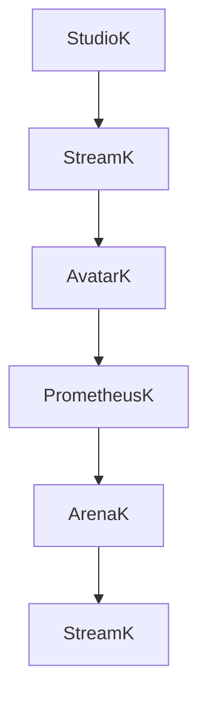

# AvatarK Platform Phase 2 Architecture — Living Platform Contracts

**Date:** 2026-07-31. **Branch:** `feature/avatar-platform-rc3`. Companion to Phase 1's
`docs/PLATFORM_CONTRACTS.md` / `CONSUMER_JOURNEY.md` / `PLATFORM_INTEGRATION_MATRIX.md` and the
Phase 1 package extraction (commit `2733353`). Phase 2 is **contracts + adapters only**: new typed
packages and additive expansions to existing ones. No application was migrated, no page redesigned,
no CSS moved, no existing behavior changed — every new package here has either zero consumers or
consumers limited to other new, equally-unconsumed packages.

## Ecosystem flow

This is the mission's own stated loop: StudioK creates, StreamK publishes, AvatarK onboards a
viewer into an identity, PrometheusK runs the practice, ArenaK turns it into a community moment,
and that community moment can re-surface through StreamK again — a flywheel, not a one-way
pipeline. As of this phase, the loop is a **documented shape**, not new implemented plumbing: the
real, confirmed crossings remain exactly what Phase 1's `CONSUMER_JOURNEY.md` already recorded
(AvatarK↔PrometheusK via the practice-handoff/receipt mechanism is real; StudioK→StreamK,
StreamK→AvatarK, ArenaK→StreamK have no implementation in this repo).

## Shared platform services

Each service below states: the package, whether it's contract-only or has any real implementation,
and what changed this phase. "Contract-only" packages have interfaces/types and, where useful, one
placeholder `*Adapter` interface — never a concrete implementation, per this phase's own instruction.

| Service | Package | Status | Phase 2 change |
|---|---|---|---|
| Identity | `@avatark/identity` | Contract only (real Supabase impl stays in `lib/identity/`) | Unchanged this phase |
| Auth | `@avatark/auth` | Two real pure utilities + a target `AuthProvider` contract | Unchanged this phase |
| Journey | `@avatark/journey` | Real step-graph logic (moved in Phase 1) | **+`JourneyTouchpointKind`** — a generic, higher-level touchpoint vocabulary (anonymous/invitation/practice/reflection/community/story/living_echo/return_visit/product_switch/cross_product_continuation), additive, not wired into `lib/journey/continuity.ts` or any page |
| Living Echo | `@avatark/living-echo` **(new)** | Contract only | `LivingEcho`, `LivingEchoSummary`, `PracticeEvidence`, `ReflectionSummary`, `PatternInsight`, `Trajectory`, `RecommendationReference`, `GrowthSignal`, `Contribution`, `SharedEchoMetadata`, one placeholder `LivingEchoAdapter`. Depends on `@avatark/timeline` (reuses its `TimelineEntry` rather than redefining one) and `@avatark/recommendations` (references `RecommendationCategory` by id) |
| Recommendations | `@avatark/recommendations` **(new)** | Contract only | `RecommendationCategory`, `RecommendationReason` (a superset of `@avatark/journey`'s existing `LivingEchoToArenaRecommendationReason`, not a competing vocabulary), `Priority`, `Confidence`, base `Recommendation`, and 5 category-specific suggestion types (`PracticeSuggestion`/`StorySuggestion`/`CommunitySuggestion`/`GameSuggestion`/`MediaSuggestion`), one placeholder `RecommendationAdapter` |
| Timeline | `@avatark/timeline` **(new)** | Contract only | `TimelineEventType` (the mission's exact 10 events), `TimelineEntry`, one placeholder `TimelineAdapter` — the canonical activity-stream shape other new packages (`living-echo`) build on |
| Organizations | `@avatark/organizations` | Contract only | `OrganizationType` widened from Phase 1's 6-value draft to the full 12-value target list (personal/family/team/company/university/school/community/conference/event/workshop/institution/temple); added 5 capability contracts (`InvitationAuthority`, `PublishingAuthority`, `RecognitionAuthority`, `ChallengeAuthority`, `MembershipAuthority`) alongside (not replacing) the existing string-list `ORG_ROLE_CAPABILITY_REFERENCE` |
| Notifications | `@avatark/notifications` | Contract only | Added `NotificationCategory` (invitation/reminder/recommendation/community/recognition/practice/story/challenge/organization/system) as a broader classification axis alongside the existing, more specific `NotificationEventType` |
| Membership | `@avatark/membership` | Contract only, one real usage | Unchanged this phase (`MembershipPlan`, already consumed by `lib/account/adapters.ts` since Phase 1) |
| Navigation | `@avatark/navigation` | Contract only | Unchanged this phase |
| Account UI | `@avatark/account-ui` **(new)** | Real, generic, headless components — zero consumers | `AvatarMenu`, `IdentityBadge`, `MembershipBadge`, `ProductSwitcher`, `JourneyRail`, `NotificationBell`, `AccountDrawer` — prop-driven, no data fetching, no app coupling, unstyled beyond structure (`className` passthrough for host styling). Not imported by any page; component design only, per this phase's "do not migrate applications" instruction |

## Product Registry audit

`@avatark/product-registry`'s `AvatarKProduct` (`packages/product-registry/src/types.ts`) already
has real, cross-repo consumers (GameK's Phase 1 platform integration reads it) — this audit is
**documentation only**; nothing in `packages/product-registry` was changed, to avoid a breaking
change to a package other repos already depend on.

| Target dimension | Real field today | Gap |
|---|---|---|
| name | `displayName` | None — present on all 9 products |
| slug | `slug` | None — present on all 9 products |
| icon | `icon` | None — present on all 9 products (placeholder design tokens, per the package's own comments, not confirmed brand assets) |
| theme | `accentColor` | Present, but only a single hex color — no broader "theme" concept (typography/elevation/etc.) exists on the registry or anywhere else, matching Phase 1's finding that no such design-token system exists in this repo at all |
| entry route | `domain` | **Partial gap** — `domain` is a full external origin (e.g. `https://prometheusk.avatark.io`), not an in-app entry route/path. No dedicated "entry route" field exists |
| account route | *(none)* | **Full gap** — no field of any kind tracks a per-product account surface route |
| supportsAuth | `requiresAuth` | **Naming/semantic gap** — `requiresAuth` means "visiting this product requires a signed-in session," not "this product consumes the shared `@avatark/auth`/`@avatark/identity` contract." No field captures the latter |
| supportsLivingEcho | `supportsEcho` | **Naming gap, likely mapping** — `supportsEcho` is `true` only for `prometheusk` today, which is consistent with "supports Living Echo," but the field is named `Echo`, not `LivingEcho` — worth an explicit rename decision later, not silently done here (see Phase 1's own Echo vs. Living Echo disambiguation in `PLATFORM_CONTRACTS.md`) |
| supportsInvitations | *(none)* | **Full gap** — no capability flag tracks which products consume `@avatark/invitations`, despite ArenaK being its documented producer and Echo/GameK/StreamK/CinemaK its documented consumers |
| supportsRecommendations | `supportsRecommendations` | None — already exists, `true` only for `prometheusk` |
| supportsOrganizations | `supportsOrganizations` | None — already exists, `true` only for `avatark` |
| supportsMembership | *(none)* | **Full gap** — no capability flag exists for membership-contract consumption |

Five of twelve target dimensions have no real field today (account route, supportsAuth,
supportsInvitations, supportsMembership fully absent; entry route and supportsLivingEcho present
under a different name/semantic). None are invented here — adding them would be a schema change to
a package with real external consumers, out of scope for a contracts-only phase.

## What's still deferred

- No application imports any Phase 2 package yet — that's the next phase's work, not this one's.
- `@avatark/account-ui`'s components are not wired into `EchoHeader`/`EchoAvatarMenu`/
  `InstitutionalHeader`/`AdminNav` (Phase 1's finding stands: those three real nav surfaces remain
  separate and unconverged).
- The registry gaps above are named, not fixed — filling them is a real, if small, breaking-change
  risk to `@avatark/product-registry`'s existing consumers and belongs in its own reviewed change.
- `supportsEcho` vs. "supports Living Echo" naming is flagged, not renamed.
