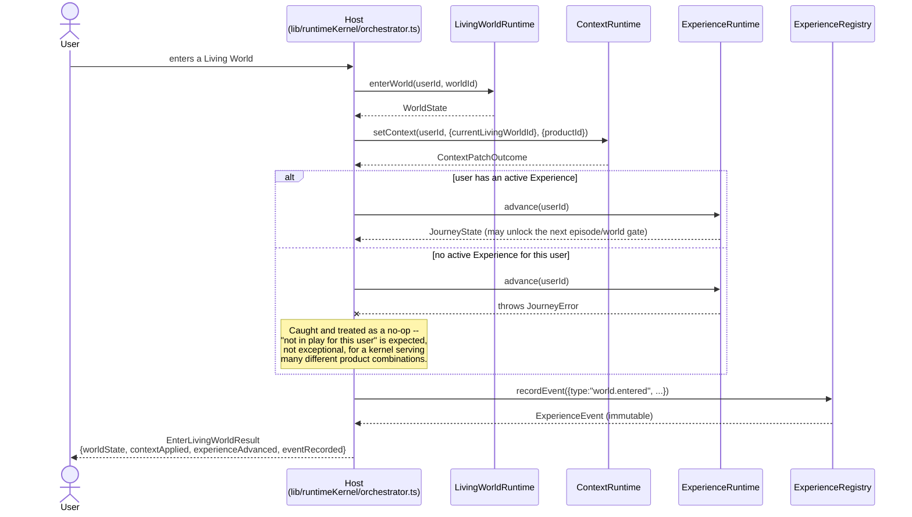

# Runtime Host Integration

How `avatark-platform-web` (the Host) wires the Runtime Kernel together. This
document is the implementation-level counterpart to
[RUNTIME_KERNEL_ARCHITECTURE.md](./RUNTIME_KERNEL_ARCHITECTURE.md)'s Part 2
diagram — this one shows what's actually built, file by file, and the sequence
diagram for the one composition helper this sprint implemented.

## Host-owned integration files, by runtime

| Runtime | Host persistence adapter | Host presentation adapter | Wired into `avatarKPlatformAdapters`? | Live API routes |
|---|---|---|---|---|
| Experience Runtime | `lib/experienceRuntime/supabaseJourneyRepository.ts` | *(none needed — its own account-page tab fetches directly, see below)* | N/A (own UI, not an `@avatark/account` adapter) | `/api/account/journey`, `/api/account/journey/*` |
| Context Runtime | `lib/context/supabaseContextRepository.ts` | `lib/account/contextAdapter.ts` (`createContextAdapter`/`currentContextAdapter`) | ✅ Yes — `lib/account/adapters.ts`'s `currentContext` field | `/api/account/context`, `/api/account/context/history` |
| Living World Runtime | *(none yet — in-memory only, not wired to app)* | `lib/livingWorldRuntime/accountAdapter.ts` (`createLivingWorldsAccountAdapter`, moved here this sprint) | ❌ Not yet — built, tested, available, not called from `lib/account/adapters.ts` | none |
| Narrative Runtime | *(none yet — in-memory only, not wired to app)* | *(none — no `@avatark/account` contract exists for "current narrative" beyond what Context already covers)* | N/A | none |
| Experience Registry | *(none yet — in-memory only, not wired to app)* | `lib/experienceRegistry/accountAdapter.ts` (`createExperienceActivityAdapter`, moved here this sprint) | ❌ Not yet — built, tested, available, not called from `lib/account/adapters.ts` | none |

**Reading this table:** two of five runtimes (Experience, Context) are fully
wired into the running app today; three (Living World, Narrative, Registry)
are fully built and tested but have zero app-level consumers — this was true
before this sprint (per the Sprint 1 audit) and remains true after it. Per
this sprint's explicit "do not touch products/UI" constraint, wiring them up
further was out of scope — this sprint's job was to make the *package*
boundaries correct (Phase 5's adapter-ownership fix), not to expand what the
app actually uses.

## The account-page naming fix (Phase 3), restated for this document's purpose

`app/account/page.tsx`'s account rail has a section with internal id `journey`
(unchanged, for URL-compatibility: `?section=journey`) whose visible label is
now **"Experience"**, not "Journey" — see
[RUNTIME_GLOSSARY.md](./RUNTIME_GLOSSARY.md) Part 2 for why. This is the only
UI text this sprint touched; no route, no query param, no API shape changed.

## Host composition: `lib/runtimeKernel/orchestrator.ts`

Per this sprint's Phase 8 ("do NOT build a large orchestration engine yet"),
exactly one composition helper exists: `enterLivingWorld()`. It takes an
already-constructed `RuntimeKernel` (a plain object bundling whichever runtime
instances a call site has) and coordinates four of the five kernel packages for
one interaction — the mission's own worked example, implemented literally.

Every arrow starts or ends at the Host. No runtime calls another runtime —
this is the literal implementation of
[DEPENDENCY_GRAPH.md](./DEPENDENCY_GRAPH.md)'s "Host as hub" model, not a new
design.

### Why each step is independently optional

A `RuntimeKernel` object may omit any runtime (its field is `?`-optional), and
`enterLivingWorld()` skips whatever isn't present rather than throwing. This
matters because the Kernel is meant to serve products with very different
runtime combinations — GameK might wire up only Living World; a
StudioK-authored narrative experience might use only Narrative. Forcing every
call site to construct all five runtimes just to use one would violate this
sprint's own "minimize coupling" instruction.

## The reference end-to-end test as a second, broader integration example

`lib/runtimeKernel/e2eKernelFlow.test.ts` (Phase 9) goes beyond the one
composition helper — it exercises all **five** runtimes (adding Narrative,
which `enterLivingWorld()` doesn't touch) via direct, explicit calls, with the
test itself playing the Host role. This is intentional: the orchestrator proves
the *pattern* for one real interaction; the E2E test proves the *breadth* — that
every runtime can participate in a single continuous, host-coordinated
workflow for one user, and that no two users' states cross-contaminate when
sharing the same runtime instances. See that file directly for the full
10-step flow (context → experience → narrative → living world → location
visit → advance → context update → registry events → resume → isolation).

## What a *future* host integration would add (not built this sprint)

- Persistence adapters for Living World, Narrative, and Registry, mirroring
  `supabaseJourneyRepository.ts`/`supabaseContextRepository.ts`'s pattern.
- Wiring `createLivingWorldsAccountAdapter`/`createExperienceActivityAdapter`
  into `lib/account/adapters.ts`'s `avatarKPlatformAdapters` (`livingWorlds`
  and `extensions` fields respectively) — both are ready to be called, per
  Phase 5's move; nobody calls them yet.
- Additional composition helpers alongside `enterLivingWorld()` for other
  interactions (e.g. "user completes a narrative beat," "user finishes a
  practice") — each one small, explicit, and Host-owned, never a generic
  engine, per this sprint's own constraint.
