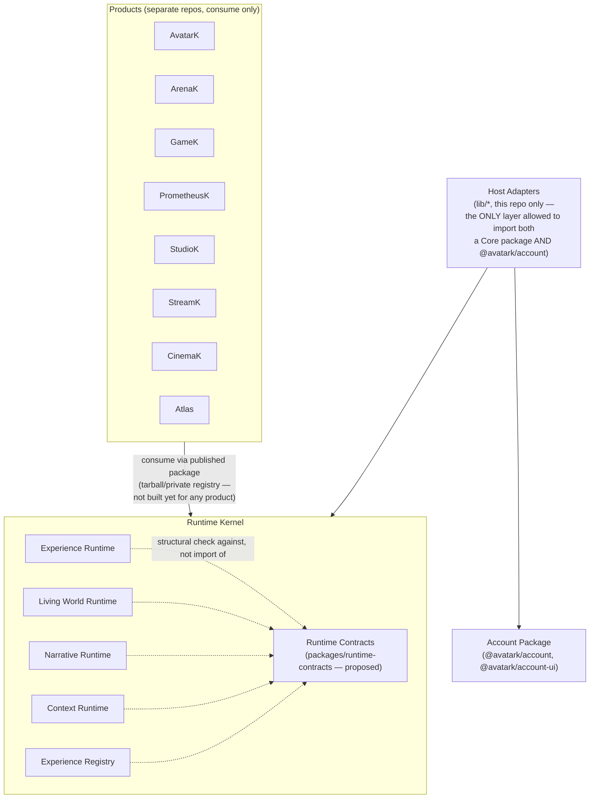

# Runtime Kernel Architecture

**Status:** this document describes the intended permanent architecture. As of this sprint, it
describes a target the five existing runtime branches already mostly satisfy — not a rewrite plan.
No behavior changes, no new packages, no merges happened to produce this document. Companion
documents: [RUNTIME_CONTRACTS.md](./RUNTIME_CONTRACTS.md),
[RUNTIME_GLOSSARY.md](./RUNTIME_GLOSSARY.md), [DEPENDENCY_GRAPH.md](./DEPENDENCY_GRAPH.md),
[MERGE_PLAYBOOK.md](./MERGE_PLAYBOOK.md).

---

## Part 1 — Adapter Ownership Matrix

The mission's target layering is `Runtime → Contracts → Host Adapter → Account Package`. This
section documents **every adapter-shaped export found across the five branches and
`@avatark/account`**, its current location, and whether it already matches the target layering.

| # | Adapter | Role (per RUNTIME_CONTRACTS.md §15) | Current location | Target layer | Status |
|---|---|---|---|---|---|
| 1 | `JourneyAdapter.onTransition` | Notification (runtime → product) | `packages/experience-runtime/src/adapter.ts` | Runtime (interface only) | ✅ Correct — no action |
| 2 | `ContextAdapter.getDefaults` | Defaults (product → runtime) | `packages/context-runtime/src/adapter.ts` | Runtime (interface only) | ✅ Correct — no action |
| 3 | `createContextAdapter` / `currentContextAdapter` | Presentation (reshape → `@avatark/account`'s `CurrentContextAdapter`) | `lib/account/contextAdapter.ts` (Host) | Host Adapter | ✅ Correct — this is the one file allowed to import both a Core package's types and `@avatark/account`'s types, and it does so from the Host, not from inside `context-runtime` |
| 4 | `lib/experienceRuntime/journeyDefinition.ts`, `supabaseJourneyRepository.ts` | Persistence + starter data (not "Adapter" role, but same layer) | `lib/experienceRuntime/*` (Host) | Host Adapter | ✅ Correct — no action |
| 5 | `createLivingWorldsAccountAdapter` | Presentation (reshape → `@avatark/account`'s `LivingWorldsAdapter`) | `packages/living-world-runtime/src/adapters/livingWorldsAccount.ts` **(inside the runtime package)** | Host Adapter | ❌ **Misplaced** — see Part 1a |
| 6 | `createExperienceActivityAdapter` | Presentation (reshape → `@avatark/account`'s `ExtensionAdapter`) | `packages/experience-registry/src/activityAdapter.ts` **(inside the runtime package)** | Host Adapter | ❌ **Misplaced** — see Part 1a |
| 7 | `AuthAdapter`, `ProfileAdapter`, `ProductAccessAdapter`, `AccessAdapter`, `OrganizationsAdapter`, `CurrentContextAdapter`, `LivingWorldsAdapter`, `NotificationsAdapter`, `MembershipAdapter`, `PreferencesAdapter`, `PrivacyAdapter`, `ExtensionAdapter` | n/a — these are the *targets* Presentation adapters reshape toward, not adapters over a runtime themselves | `packages/account/src/contracts/adapters.ts` | Account Package | ✅ Correct — this is exactly the bottom box in the mission's own diagram; no action |

### Part 1a — The one concrete fix this matrix identifies

Rows 5 and 6 both ship *inside* their runtime package, structurally mirroring `@avatark/account`'s
contracts without a compile-time `import` of it. Neither is a coupling bug in the strict sense (no
package actually imports `@avatark/account`) — but it violates the *spirit* of "no runtime should
directly depend on account," because:

- Every consumer of `@avatark/living-world-runtime` or `@avatark/experience-registry` — including a
  future satellite repo with no `@avatark/account` at all — carries a file whose only reason to
  exist is matching a contract it may never use.
- `context-runtime` and `experience-runtime` already solved the identical problem correctly (rows 3
  and 4) by putting the equivalent glue in the Host's `lib/` instead of inside the package.

**Recommended fix (not applied this sprint — flagged for the merge steps in
[MERGE_PLAYBOOK.md](./MERGE_PLAYBOOK.md)):**

- Move `packages/living-world-runtime/src/adapters/livingWorldsAccount.ts` →
  `lib/livingWorldRuntime/accountAdapter.ts`
- Move `packages/experience-registry/src/activityAdapter.ts` →
  `lib/experienceRegistry/accountAdapter.ts`

Both moves are file relocations with no behavior change (the functions' logic doesn't reference
anything package-internal that wouldn't also be available from `lib/`), so they satisfy "do not
rewrite working code" — this is a `git mv` plus an import-path fix, not a redesign.

---

## Part 2 — Runtime Kernel Architecture Diagram

Reading this diagram correctly matters more than the picture itself: **the arrows from Products
point down into the Kernel, and the arrows from Host Adapters point down into both the Kernel and
Account — nothing inside the Kernel points up, sideways to another Kernel package, or down into
Account.** This isn't a chain (`Experience → Narrative → LivingWorld → Registry`, as an earlier
sketch of this idea suggested) — it's a set of siblings, each independently a leaf, each reachable
from the Host or from a Product, never reachable from each other. See
[DEPENDENCY_GRAPH.md](./DEPENDENCY_GRAPH.md) for the verified cycle-freedom check behind this claim.

### Why "Kernel" is the right word for this layer

An OS kernel provides mechanism, not policy — it doesn't know or care which application called it.
Every one of the five runtime packages already has this property: none names a product, none
imports `@avatark/account`, none assumes a particular UI. `JourneyDefinition`,
`WorldDefinition`, `NarrativeDefinition` are all **data** a caller supplies — the Kernel executes
whatever definition it's given, the same way an OS kernel executes whatever program it's given. The
mission's instruction to keep this layer product-independent isn't a new constraint being imposed
this sprint — it's naming a property the five branches already, correctly, built.

### What the Kernel is not

It is not a scheduler, a message bus, or a process manager (the systems-programming senses of
"kernel" that don't apply here) — no runtime here manages concurrency or resource contention between
products. It is not a single merged package — the five stay separate (per this sprint's own
constraint not to collapse or redesign). "Kernel" names the *role* these five packages plus the
proposed contracts package play together, not a new artifact replacing them.

---

## Part 3 — Future Products

### The generic integration contract (identical for every product)

Every product — regardless of which one — plugs into the Runtime Kernel the same three ways, and
**no product should implement any of these itself**:

1. **Consume a Core package as a published dependency.** Per
   [PLATFORM_INTEGRATION_SPRINT_1.md](./PLATFORM_INTEGRATION_SPRINT_1.md) §6, the established
   mechanism is a versioned tarball/private-registry package — the same pattern GameK already uses
   for `@avatark/account`. No product repo has a monorepo import path into this one; the
   distribution boundary is a publish step, not a workspace link.
2. **Supply data, not code, wherever a runtime expects a Definition.** `JourneyDefinition`,
   `WorldDefinition`, `NarrativeDefinition` are the product-specific part of any integration — and
   they're plain data (JSON-serializable), never a subclass or an override of runtime behavior. A
   product authors its own definitions; it never forks or extends the runtime that executes them.
3. **Implement only the Runtime-role adapters the Kernel's contracts define** (`NotificationAdapter`,
   `DefaultsAdapter` — see [RUNTIME_CONTRACTS.md](./RUNTIME_CONTRACTS.md) §15) — never a
   `PresentationAdapter`, which is exclusively a Host concern (Part 1 above) and has nothing to do
   with a product's own integration.

### Per-product notes (only where something specific is actually known)

| Product | What's actually known | Integration shape |
|---|---|---|
| **AvatarK** (this repo) | Already the Host for `experience-runtime` and `context-runtime`; the other three Core packages built but unwired | Host role — the only "product" that is also the Host, since the Kernel physically lives in this repo today |
| **StudioK** | Per `narrative-runtime`'s own package description: "StudioK authors the definitions this package executes" | **Data dependency, not code.** StudioK's integration surface is authoring `NarrativeDefinition` JSON validated by `validateNarrativeDefinition` — it never needs to import or execute `createNarrativeRuntime()` itself. This is categorically different from the other products' integration and is worth remembering when scoping any future StudioK-facing tooling: build an authoring/validation tool against the schema, not a runtime integration. |
| **ArenaK, GameK, StreamK, CinemaK, PrometheusK** | Separate repos, confirmed zero current imports of any Core package (per Sprint 1's cross-repo audit) | Code dependency (role 1 above), once published — not built for any of them yet. Which Core packages each one needs is a per-product decision outside this sprint's scope (e.g. GameK may want only `living-world-runtime`; nothing here assumes all five apply to every product). |
| **Atlas** | **Nothing.** Atlas does not appear in Sprint 1's cross-repo audit, in any of the five branches, or anywhere else in this repository. This sprint's brief is the first mention of it anywhere in the available record. | No product-specific integration notes are invented here. Atlas gets exactly the same three-part generic contract above as any other product — nothing more can honestly be said about it without fabricating context that doesn't exist. If Atlas has needs the generic contract doesn't cover, that's new information for whoever owns it to bring, not something to guess at here. |

### The one rule that keeps every future product safe

**No product should own runtime logic; products consume runtime services only** (the mission's own
words, restated because it's the load-bearing rule for everything above). Concretely: if a product
ever needs behavior a Core package doesn't provide, the fix is extending that Core package's
contract (a Kernel change, reviewed and versioned centrally) — never forking the runtime inside the
product's own repo. This is what keeps the "Products → Kernel, one direction, never reversed" arrow
in Part 2's diagram true as more real products actually integrate.
