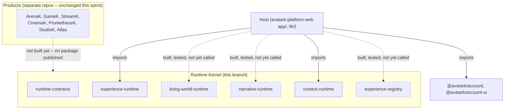

# Runtime Kernel Implementation Report

**Sprint 3 — Runtime Kernel Integration.** This document is the implementation-level
summary; see [RUNTIME_KERNEL_MERGE_REPORT.md](./RUNTIME_KERNEL_MERGE_REPORT.md) for
the phase-by-phase merge log with commit hashes,
[RUNTIME_HOST_INTEGRATION.md](./RUNTIME_HOST_INTEGRATION.md) for how the Host wires
everything together, and [RUNTIME_MIGRATION_MAP.md](./RUNTIME_MIGRATION_MAP.md) for
the migration reconciliation. Sprint 2's design documents
(`docs/RUNTIME_KERNEL_ARCHITECTURE.md`, `docs/RUNTIME_CONTRACTS.md`,
`docs/RUNTIME_GLOSSARY.md`, `docs/MERGE_PLAYBOOK.md`, `docs/DEPENDENCY_GRAPH.md`) are
**not rewritten here** — this document records what implementation evidence
confirmed or refined, not a new architecture.

## What exists now that didn't before this sprint

- `packages/runtime-contracts` — real, dependency-free, 8 structural tests.
- All five runtime packages (`experience-runtime`, `living-world-runtime`,
  `narrative-runtime`, `context-runtime`, `experience-registry`) coexist on one
  branch, `feature/runtime-kernel-integration`.
- `lib/runtimeKernel/orchestrator.ts` — the one Host composition helper this
  sprint's Phase 8 asked for.
- `lib/runtimeKernel/e2eKernelFlow.test.ts` — the reference end-to-end test.
- `lib/runtimeKernel/dependencyBoundaries.test.ts` — the static enforcement
  Phase 10 asked for.
- `lib/livingWorldRuntime/accountAdapter.ts` and
  `lib/experienceRegistry/accountAdapter.ts` — the two account-adapters moved
  out of their runtime packages.

## 1. Integrated package inventory

| Package | Origin commit | Zero `@avatark/*` deps? | Test count contributed |
|---|---|---|---|
| `@avatark/runtime-contracts` | `3ec2d7c` (this sprint) | ✅ Yes (zero deps of any kind, own dependency) | 8 |
| `@avatark/narrative-runtime` | `feature/narrative-runtime` @ `eb6def1` | ✅ Yes | 25 |
| `@avatark/living-world-runtime` | `feature/living-world-runtime` @ `b7a986d` | ✅ Yes | 29 (5 relocated to `lib/livingWorldRuntime/`, still counted) |
| `@avatark/experience-registry` | `feature/experience-registry` @ `a9c0bb2` | ✅ Yes | 37 (5 relocated to `lib/experienceRegistry/`, still counted) |
| `@avatark/context-runtime` | `feature/context-runtime` @ `1640997` | ✅ Yes | 34 (plus 5 in `lib/account/contextAdapter.test.ts`) |
| `@avatark/experience-runtime` | `feature/experience-runtime` @ `4c1baef` | ✅ Yes | 24 (20 original + 4 new compatibility-alias tests) |

All six packages verified, by static check
(`lib/runtimeKernel/dependencyBoundaries.test.ts`), to declare zero
`@avatark/*` dependencies beyond (optionally) `runtime-contracts`, and to
import nothing beyond that in source. None currently imports
`runtime-contracts` in practice — that remains a future, opt-in convergence,
per Sprint 2's own design (not a regression; nothing required it this sprint).

## 2. Shared contracts inventory

`packages/runtime-contracts/src/index.ts` exports, by category:

- **Identifiers** (`src/ids.ts`): `UserId`, `ProductId`, `OrganizationId`,
  `ExperienceId`, `NarrativeId`, `EpisodeId`, `SceneId`, `BeatId`, `WorldId`,
  `LocationId`, `PracticeId`, `ReflectionId`, `ChallengeId`, `MilestoneId`,
  `CohortId`, `InvitationId`, `AvatarId`, `Timestamp` — all plain `string`
  aliases, matching the convention every existing runtime already uses (no
  branded types — that would touch every existing function signature, which
  this sprint's "no breaking API changes" rules out).
- **Reference** (`src/reference.ts`): generic `Reference<TKind>` plus named
  aliases (`PracticeRef`, `ReflectionRef`, `WorldRef`, `EpisodeRef`,
  `NarrativeRef`, `SceneRef`, `ChallengeRef`, `MilestoneRef`).
- **Snapshot / State / Lifecycle** (`src/snapshot.ts`, `src/state.ts`,
  `src/lifecycle.ts`): `Snapshot<TFields>`, `State<TStatus>`,
  `LifecyclePhase` (5 values — confirmed `JourneyStatus` already matches
  exactly).
- **Transition / Event** (`src/transition.ts`, `src/event.ts`): the thin
  `Transition<TType>` shape and the rich `Event<TType,TMetadata>` shape,
  deliberately kept separate (see `RUNTIME_GLOSSARY.md`).
- **Progress / History / Checkpoint / Version** (`src/progress.ts`,
  `src/history.ts`, `src/checkpoint.ts`, `src/version.ts`): `Progress`,
  `History<TEntry>`, `Checkpoint<TState>` (the one genuinely new, anticipatory
  contract — no existing package has this concept yet), `Versioned` /
  `VersionedDefinition` (two independent versioning axes).
- **Resolver / Repository** (`src/resolver.ts`, `src/repository.ts`):
  `Resolver<TInput,TOutput>`, `Repository<TState,TKey>`,
  `HistoryRepository<TEntry,TKey>`.
- **Adapter, 3 roles** (`src/adapter.ts`): `NotificationAdapter<TEvent>`,
  `DefaultsAdapter<TFields>`, `PresentationAdapter<TOutput>` — kept distinct
  rather than one generic shape, per the three-role finding in
  `RUNTIME_KERNEL_ARCHITECTURE.md`.
- **Host / Runtime** (`src/host.ts`, `src/runtime.ts`): `HostContext`,
  `RuntimeFactory<TOptions,TInstance>`.

Every export is `export type` except the type aliases in `reference.ts`
(themselves type-only). No class, no function with a body, no default value —
verified by the package's own zero-implementation charter and its
`contracts.test.ts`'s 8 structural-satisfiability tests.

## 3. Final dependency graph

**Cycle check:** zero cycles, statically enforced by
`lib/runtimeKernel/dependencyBoundaries.test.ts` (13 tests) and confirmed by
`pnpm list --depth -1 -r`, which reported no circular-dependency warnings.
A cycle would require some Kernel package to import `@avatark/account` or the
Host, or two Kernel packages to import each other — both are structurally
impossible today, verified, not assumed. See
[DEPENDENCY_GRAPH.md](./DEPENDENCY_GRAPH.md) (Sprint 2) for the full
role-tier/depth-tier discussion this graph is a refresh of.

## 4. Naming decisions

Per [RUNTIME_GLOSSARY.md](./RUNTIME_GLOSSARY.md), applied exactly as scoped —
least-disruptive fix, no architecture redesign:

- **User-facing copy changed** (and only this): `app/account/page.tsx`'s
  "Journey" tab label → "Experience"; button/status copy ("Start Journey" →
  "Start Experience", "Journey complete." → "Experience complete.", etc.);
  the starter definition's title ("Welcome Journey" → "Welcome Experience").
- **Not changed**: the section's internal id (`journey`, so `?section=journey`
  still works), the API route path (`/api/account/journey`), any type name in
  `packages/experience-runtime`, and `packages/journey` itself (explicitly out
  of scope, confirmed untouched via `git diff`).
- **Compatibility aliases added** (documented, non-breaking):
  `packages/experience-runtime/src/index.ts` now also exports
  `ExperienceDefinition`, `ExperienceStatus`, `ExperienceState`,
  `ExperienceTransitionType`, `ExperienceTransition`, `ExperienceHistory`,
  `ExperienceProgress`, `ExperienceRuntimeError`, `ExperienceRepository`,
  `ExperienceRuntimeAdapter`, and `ExperienceRuntime` — every one a re-export
  of the existing `Journey*` name under the package's own vocabulary
  (`@avatark/experience-runtime`), proven identical (not a copy) by 4 tests in
  `packages/experience-runtime/src/compatibilityAliases.test.ts`.

## 5. Adapter moves

Both violations `docs/RUNTIME_KERNEL_ARCHITECTURE.md` (Sprint 2) identified,
fixed:

| From | To |
|---|---|
| `packages/living-world-runtime/src/adapters/livingWorldsAccount.ts` | `lib/livingWorldRuntime/accountAdapter.ts` |
| `packages/experience-registry/src/activityAdapter.ts` | `lib/experienceRegistry/accountAdapter.ts` |

Both moves were detected by `git` as pure renames (content unchanged except
import paths switching from package-relative to the public
`@avatark/living-world-runtime`/`@avatark/experience-registry` exports — both
already publicly exported everything the moved files needed). Both runtime
packages' `index.ts` no longer export anything account-shaped; both now have
**zero** `@avatark/*` references anywhere in their `src/`, confirmed by grep
(previously, only comment references existed — now none at all, since the
referencing files are gone). Neither moved adapter is wired into
`lib/account/adapters.ts` yet — see `RUNTIME_HOST_INTEGRATION.md` for what a
future wiring pass would look like.

## 6. Migration renumbering

Summarized here; full detail in
[RUNTIME_MIGRATION_MAP.md](./RUNTIME_MIGRATION_MAP.md).

`023_experience_events.sql` (unchanged) · `023_context_snapshots.sql` →
`024_context_snapshots.sql` · `023_journey_states.sql` →
`025_journey_states.sql`. Zero foreign keys between the three schemas. All
three now registered in `supabase/scripts/run-platform-migrations.js`'s
`MIGRATION_ORDER`. **Nothing applied.** `019`–`022` preserved byte-for-byte.

## 7. Merge checkpoints and commit hashes

See [RUNTIME_KERNEL_MERGE_REPORT.md](./RUNTIME_KERNEL_MERGE_REPORT.md) for the
full table. Twelve commits total, all on `feature/runtime-kernel-integration`.

## 8. E2E kernel-flow result

`lib/runtimeKernel/e2eKernelFlow.test.ts` — **2/2 tests pass.** The first
exercises the full 10-step flow (create context → start experience → start
narrative → enter living world → visit a location → advance experience →
update context → record 2 registry events, most-recent-first order verified →
resume state across independent re-reads of every runtime → all assertions
pass). The second verifies user isolation: two users sharing the exact same
runtime instances (not separate objects — the real isolation test) never see
each other's context, experience progress, narrative state, world state, or
registry events. Generic fixtures only (`generic-world`, `generic-experience`,
`generic-narrative`, `generic-product`) — no franchise content anywhere, as
required.

## 9. Test / build results (Phase 11)

| Check | Result |
|---|---|
| `pnpm lint` | 0 errors, 6 warnings (identical to the pre-existing 6 — no new lint issues introduced) |
| `pnpm typecheck` | Clean, 0 errors |
| `pnpm test` | **746/746 pass**, 0 failures (up from 579 before this sprint began — see below for the breakdown) |
| `pnpm build` | Exit code 0, all routes built, 0 errors |
| `pnpm build:packages` | **25/25 packages built**, exit code 0 |
| `pnpm pack:packages` | **25/25 packages packed**, manifest written, exit code 0 |
| Dependency-cycle result | **Zero cycles** — statically enforced (13 tests) and confirmed via `pnpm list --depth -1 -r` |

Test-count growth across this sprint: 579 (baseline) → 728 (after all 5 merges
+ contracts package) → 746 (final, after Phases 8–10's new tests). No
pre-existing test was modified or deleted; every number above is net-additive.

## Remaining risks

Carried over from Sprint 2 (still true) and refined by this sprint's actual
implementation experience — see
[RUNTIME_KERNEL_MERGE_REPORT.md](./RUNTIME_KERNEL_MERGE_REPORT.md) for the
full conflict-prediction-vs-reality table:

1. **Migration backlog now five deep** (`020`, `022`, `023`, `024`, `025`),
   none applied. Growing, not shrinking, until someone with real database
   access runs a dedicated backlog-application pass.
2. **Living World, Narrative, and Registry remain unwired to the running
   app.** Fully built, fully tested, zero consumers. Not a defect this sprint
   introduced (true since Sprint 1) — but the gap is now three sprints old.
3. **`@avatark/timeline` vs `@avatark/experience-registry` still
   unreconciled** — cheap to fix today (neither has a real consumer), gets
   more expensive the moment either one does.
4. **The "Journey" naming fix is copy-only.** The underlying types
   (`JourneyDefinition`, `JourneyRuntime`, etc.) still carry the ambiguous
   name internally — the compatibility aliases make a future full rename
   possible without a breaking change, but that rename hasn't happened.
5. **No live browser/UI smoke test was possible** for either
   `/api/account/context` or `/api/account/journey` — this environment has no
   test-session Supabase credentials (a pre-existing, known limitation, not
   new to this sprint). Automated tests for the underlying logic all pass;
   the actual rendered UI was not visually confirmed.

## Recommendation for Sprint 4

1. **Wire at least one of the three unwired runtimes into the running app** —
   Living World is the most natural next candidate (its account adapter is
   built and moved to the correct location; it just needs a persistence
   adapter and a call from `lib/account/adapters.ts`).
2. **Apply the migration backlog** (`020`, `022`, `023`, `024`, `025`) against
   a real, reviewed database — a prerequisite this sprint explicitly could not
   do itself.
3. **Decide the `@avatark/timeline` question** before either package gets a
   real consumer.
4. **Only after 1–3** — begin evaluating whether any product repo (ArenaK,
   GameK, StreamK, CinemaK, PrometheusK, StudioK) is ready to consume a
   published Kernel package via the tarball mechanism. Explicitly out of
   scope for Sprint 3 and, per this sprint's own instruction, likely out of
   scope for Sprint 4 too unless 1–3 are done first.
